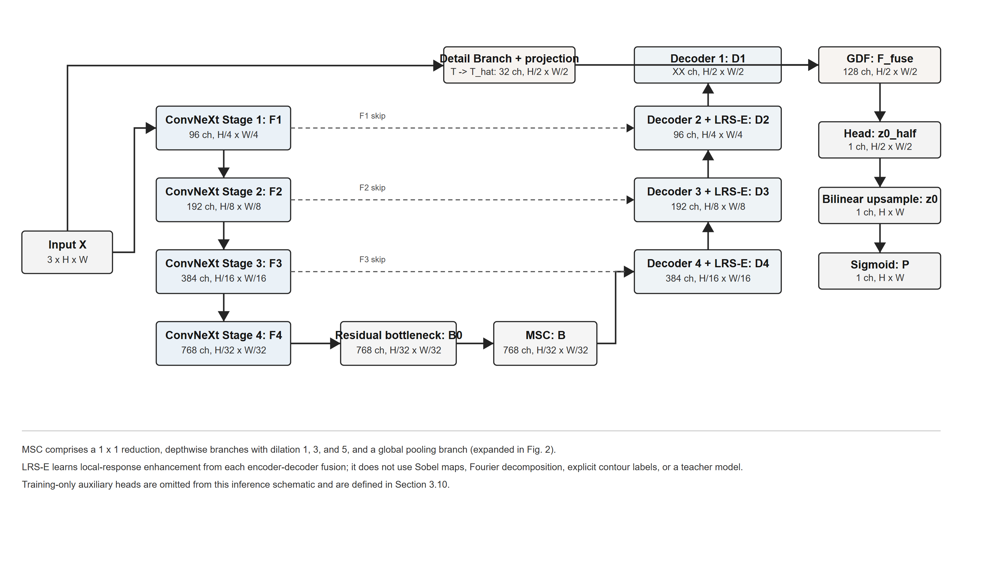
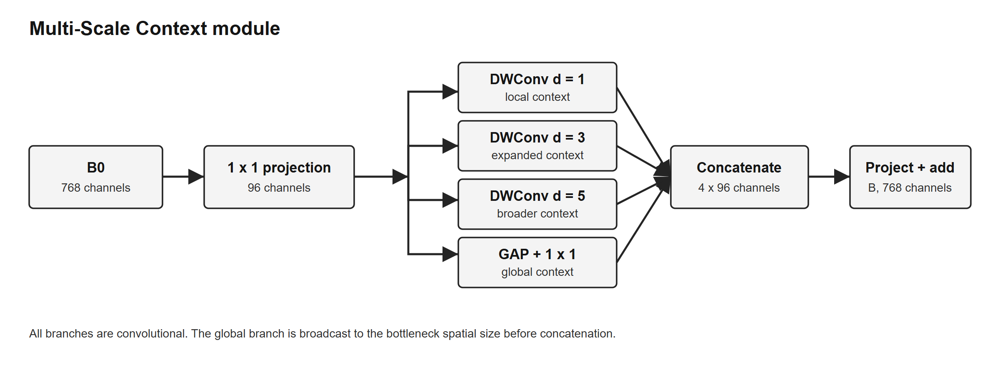
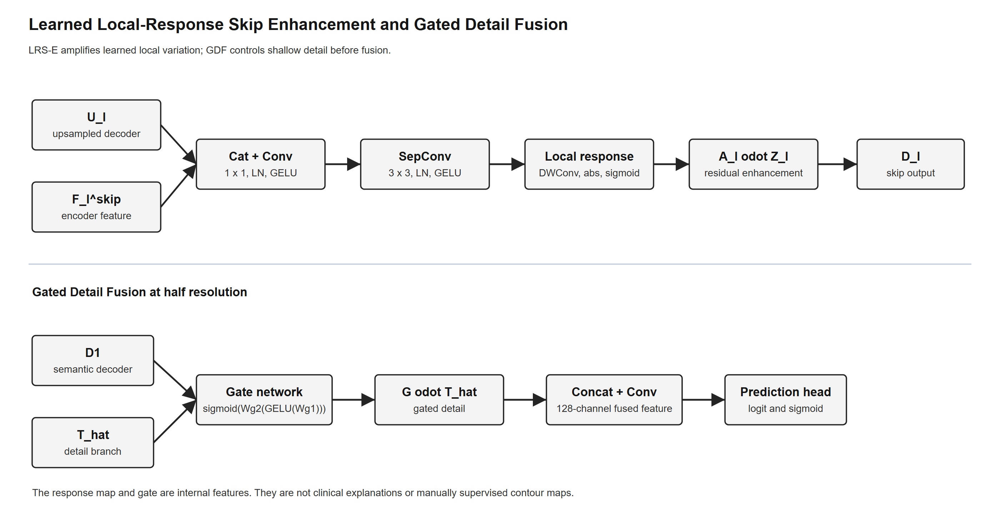
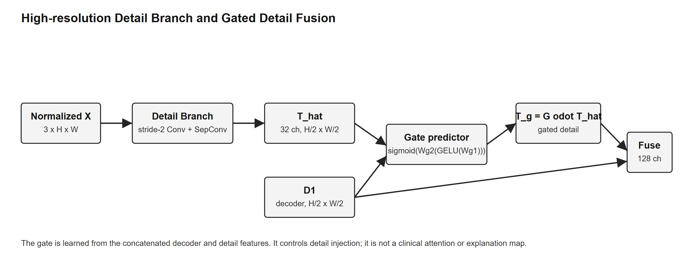
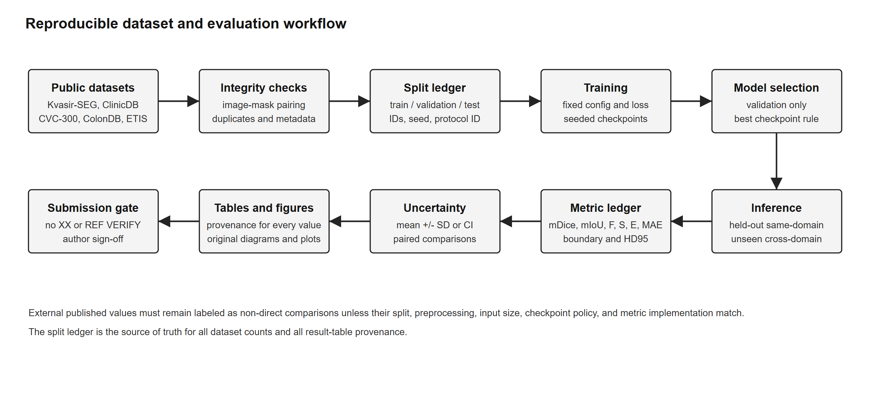

# A ConvNeXt-Tiny U-Net with Multi-Scale Context, Learned Local-Response Skip Enhancement, and Gated Detail Fusion for Colorectal Polyp Segmentation

**[AUTHOR NAMES]**

**[AFFILIATIONS]**

**Corresponding author:** [XX_CORRESPONDING_AUTHOR_EMAIL]

## Abstract

Accurate colorectal polyp segmentation is difficult because lesions vary substantially in size, morphology, texture, color, and boundary visibility. Image quality can also be degraded by specular highlights, motion blur, bubbles, shadows, folds, and surgical instruments. These factors make it difficult for a segmentation model to combine reliable semantic localization with precise contour recovery. This study presents a U-shaped convolutional network with a ConvNeXt-Tiny encoder for colorectal polyp segmentation. A Multi-Scale Context (MSC) module is placed at the bottleneck and combines three dilated depthwise-convolution branches with a global-context branch. In the decoder, Learned Local-Response Skip Enhancement (LRS-E) refines skip-connected features through learned local-response enhancement. A shallow Detail Branch preserves high-resolution image information that may be weakened by the stride-4 encoder stem, and Gated Detail Fusion (GDF) controls how this representation enters the final decoder stage. Three auxiliary prediction heads provide deep supervision during training. The model is intended for evaluation on Kvasir-SEG, CVC-ClinicDB, CVC-300 (EndoScene), CVC-ColonDB, and ETIS-LaribPolypDB under a fixed split and a cross-dataset protocol. The final abstract must report **XX** mDice, **XX** mIoU, **XX** trainable parameters, and **XX** GFLOPs after the split, checkpoint, metric implementation, and repeated-run uncertainty have been verified.

**Keywords:** colorectal polyp segmentation; medical image segmentation; ConvNeXt; U-Net; boundary-sensitive feature fusion; deep supervision

## 1. Introduction

Colorectal polyps are focal mucosal lesions that may progress to colorectal cancer. Colonoscopy enables direct inspection and removal of suspicious lesions, while public endoscopic-image datasets provide a basis for developing and evaluating automated segmentation methods [15-19]. Computer-aided segmentation can provide a pixel-level estimate of lesion extent for image-analysis research [15,16,18,19]. The present study concerns image segmentation only; it does not evaluate clinical diagnosis, treatment decisions, or prospective clinical benefit.

Accurate segmentation remains challenging because polyps differ widely in size, shape, color, texture, and location [4,7-10]. Large and protruding lesions may have a visually distinct appearance, whereas small or flat lesions can occupy only a few pixels and may be partially hidden by folds. The boundary between lesion and surrounding mucosa is often weak, irregular, or interrupted. Specular reflection, bubbles, blur, stool, shadows, and instruments introduce additional structures that can resemble a lesion [7,9,10]. A useful model must therefore capture both broad context and local appearance while avoiding the transfer of irrelevant background responses.

U-shaped encoder-decoder networks are widely used in biomedical segmentation. Their contracting paths build hierarchical semantic representations, and their expanding paths recover spatial resolution. Skip connections transfer high-resolution encoder features to the decoder and improve localization. However, direct concatenation or addition does not explicitly control which low-level responses should be retained. Shallow features may preserve useful contours, but they may also contain texture, illumination, and acquisition artifacts. Repeated down-sampling can produce the opposite problem by removing fine structures before the decoder can recover them. U-Net established the basic design, while UNet++ demonstrated that redesigned skip pathways and deep supervision can reduce the semantic gap between encoder and decoder features [1,2].

Global-context modeling offers one way to address large variation in lesion size. Transformer and hybrid convolution-transformer models can establish long-range interactions, and polyp-specific designs such as TransUNet and Polyp-PVT have shown the value of contextual representations [3,4]. These approaches can be effective, but their attention and cross-level fusion operations may increase computational and implementation complexity. ConvNeXt provides an alternative convolutional design that combines large-kernel depthwise convolution, inverted channel expansion, Layer Normalization, GELU activation, layer scaling, and stochastic depth [5]. It retains the regular spatial processing of convolutional networks while providing a strong hierarchical encoder.

Boundary-aware segmentation methods use explicit edge supervision, reverse attention, contour branches, or boundary-sensitive feature fusion. PraNet uses reverse attention to refine incompletely segmented regions [7]. MEGANet and MSBP-Net demonstrate the value of multi-scale edge or boundary modeling for weak lesion contours [9,10]. These strategies also show a potential limitation: a hand-crafted edge response can be activated by folds, reflections, bubbles, or instruments. A learned feature response should therefore be interpreted as a boundary-sensitive cue rather than as a ground-truth contour detector.

This paper develops a unified convolutional architecture that tests three related design hypotheses. First, a multi-scale bottleneck should provide complementary local, enlarged-receptive-field, and global-context information. Second, a learned local-response modulation at skip-connected decoder stages should amplify locally varying features without requiring manually generated edge maps. Third, a high-resolution detail branch should be useful when its contribution is conditioned on the semantic decoder representation rather than added without control. The architecture combines these mechanisms in a ConvNeXt-Tiny U-Net and is designed for evaluation on five public polyp-segmentation datasets.

The contributions of this study are as follows:

1. We formulate a ConvNeXt-Tiny U-shaped network for colorectal polyp segmentation that combines hierarchical convolutional encoding with a progressively upsampled decoder.
2. We introduce a Multi-Scale Context module with three dilated depthwise-convolution branches and a global-context branch at the bottleneck.
3. We introduce Learned Local-Response Skip Enhancement (LRS-E) for learned local-response enhancement of skip-connected features. The module does not use Sobel filtering, Fourier decomposition, manually generated contour maps, or a separate boundary annotation.
4. We use a high-resolution Detail Branch and Gated Detail Fusion to preserve shallow spatial information while controlling its contribution to the final decoder representation.
5. We use auxiliary prediction heads for deep supervision and define an ablation protocol that separates component contributions from alternative detail-fusion strategies.
6. We specify a same-dataset and cross-dataset evaluation protocol for Kvasir-SEG, CVC-ClinicDB, CVC-300 (EndoScene), CVC-ColonDB, and ETIS-LaribPolypDB. All numerical results remain **XX** until the final split files, checkpoints, and metric implementation are reconciled.

## 2. Related Work

### 2.1. Convolutional encoder-decoder networks

U-Net uses a contracting path to extract increasingly semantic features and an expanding path to recover spatial detail. Its skip connections make high-resolution representations available during reconstruction and have made the architecture a standard reference for biomedical segmentation [1]. UNet++ replaces direct skip connections with nested, dense pathways and applies deep supervision to reduce the semantic discrepancy between features at different depths [2]. These designs motivate treating the skip pathway as a learnable part of the segmentation model rather than as a fixed tensor-transfer operation.

Polyp-specific convolutional networks have explored different ways of obtaining contextual and boundary information with modest computational cost. HarDNet-MSEG uses a low-memory-traffic encoder and a compact decoder [6]. PraNet combines a parallel partial decoder with reverse attention to focus on regions that remain uncertain after an initial prediction [7]. These approaches establish strong convolutional baselines, but they do not directly address the selective refinement of every skip-connected feature in the present design.

### 2.2. Global and multi-scale context modeling

Lesions may occupy a small part of an image or extend across a large region. A model must preserve local evidence for small lesions while using a sufficiently broad receptive field to distinguish a lesion from surrounding mucosa. Dilated convolution, pyramid pooling, multi-branch processing, and cross-scale aggregation are common solutions.

Transformer-based segmentation models use self-attention or related operations to represent long-range spatial dependencies. TransUNet combines a convolutional encoder with a transformer representation [3], and Polyp-PVT uses hierarchical transformer features for polyp segmentation [4]. More recent polyp models have also used state-space or frequency-aware processing. Polyp-Mamba, for example, combines multi-frequency perception with gated selection [8]. The present network uses neither self-attention nor frequency decomposition. Instead, the MSC module uses parallel depthwise convolutions with dilation rates 1, 3, and 5 and a pooled global-context branch. This provides an experimentally testable convolutional alternative with a simple spatial structure.

ConvNeXt modernizes conventional convolutional design through large-kernel depthwise convolution, Layer Normalization, GELU activation, inverted channel expansion, layer scaling, and stochastic depth [5]. These components are useful for this study because they provide hierarchical features while keeping the encoder structure regular and compatible with a U-shaped decoder.

### 2.3. Boundary-aware polyp segmentation

Weak boundaries are a major source of false positives, missed pixels, and contour errors in polyp segmentation. Boundary-aware approaches use edge labels, contour prediction, reverse attention, gradient-derived features, or boundary-guided fusion. MEGANet uses multi-scale edge-guided attention for weak boundary segmentation [9], while MSBP-Net predicts boundaries at multiple scales [10]. These methods support the general premise that local structural information should remain available during decoding.

The LRS-E module differs from an explicitly supervised contour branch. It transforms the concatenated encoder-decoder feature and computes a learned local-response map from a depthwise convolution. The absolute response is passed through a sigmoid and used for residual modulation. The response may correlate with lesion boundaries, but it may also respond to other local structures. Accordingly, this paper uses the term boundary-sensitive to describe the module motivation and does not claim that its response is a ground-truth edge map. Boundary-specific conclusions require the additional contour metrics in Section 4.4 and visual analyses in Section 5.5.

### 2.4. Detail preservation and adaptive feature fusion

Deep features provide semantic discrimination but have low spatial resolution. Shallow features retain local appearance and edge information but are more sensitive to background texture and imaging artifacts. Direct fusion can therefore either lose useful detail or transfer noise. Attention and gating provide a way to make this interaction conditional on the current semantic representation.

The proposed Detail Branch begins with the input image and operates at one-half of the input resolution. GDF estimates a spatial and channel-wise gate from the decoder feature and the projected detail feature. The gate is applied before concatenation and projection. The purpose of this operation is not to assert that every gate value corresponds to a clinically meaningful region; rather, it creates a controlled comparison between learned detail selection and simple concatenation or addition.

### 2.5. Positioning of the proposed method

Recent studies make clear that no single component in the proposed title is new by itself. Lesion-aware context interaction and multi-scale feature fusion have been studied by LACINet and MFEFNet [24,26]. Edge complementarity, boundary uncertainty, and explicit contour refinement have been explored by ECTransNet, the boundary-uncertainty network, Polyper, and Boundary Refinement Network [25,27,30,31]. CAFE-Net uses cross-attention for feature exploration [32], while Polyp-Mamba and PolyMamba-Net use frequency or state-space mechanisms together with gating or boundary processing [8,34]. MEIN models uncertainty through evidence integration [21]. Recent models such as MLB-Net, HCA-Net, and DVFIP-Net further strengthen lesion-aware, contextual, and feature-interaction baselines [35-37].

Foundation-model and distillation methods create a separate comparison group. LiteBounD combines foundation-model distillation with frequency and boundary alignment, and BDKD-Net uses boundary-probability distillation [39,40]. The present model uses neither a teacher network nor a distillation loss. It is a deterministic, convolution-only design whose testable contribution is the specific placement of MSC, LRS-E, and GDF in one ConvNeXt-Tiny encoder-decoder. This distinction must be demonstrated through matched ablations and protocol-controlled comparisons rather than through a priority claim.

**Table 1. State-of-the-art mechanisms and their relationship to the proposed model.** The table summarizes architectural positioning, not a ranking of published performance. Values in later comparison tables are not assumed to be directly comparable unless the protocol is reproduced.

| Method | Year | Main mechanism | Relationship to the proposed model |
|---|---:|---|---|
| LACINet [24] | 2023 | Lesion-aware contextual interaction | Context interaction is established; the proposed MSC is a convolutional bottleneck alternative. |
| ECTransNet [25] | 2023 | Multi-scale edge complementarity | Uses explicit edge-oriented processing; LRS-E uses learned local response without edge labels. |
| MFEFNet [26] | 2023 | Multi-scale feature enhancement and fusion | Supports multi-scale fusion as prior art rather than a standalone novelty claim. |
| Boundary-uncertainty network [27] | 2024 | Boundary uncertainty modeling | Models uncertainty explicitly; the proposed model is deterministic unless uncertainty experiments are added. |
| TransNetR [28] | 2024 | Transformer residual network and multi-center OOD testing | Provides a strong protocol comparator for cross-center generalization. |
| CASCADE [29] | 2023 | Cascaded attention decoding | Attention-decoder comparator; the proposed decoder uses convolutional LRS-E and GDF instead. |
| MEGANet [9] | 2024 | Multi-scale edge-guided attention | Uses edge-guided attention; LRS-E does not require explicit edge maps. |
| Polyper [30] | 2024 | Boundary-sensitive attention | Shows that boundary-sensitive terminology is not unique to this study. |
| CAFE-Net [32] | 2024 | Cross-attention and feature exploration | Uses attention-based fusion; the proposed model remains convolution-only. |
| AAPCNet [33] | 2025 | Asymmetric multi-scale attention | Additional multi-scale attention comparator; acronym mapping requires verification. |
| Polyp-Mamba [8] | 2025 | Multi-frequency perception, Mamba, and gated selection | Uses frequency and state-space operations absent from the proposed model. |
| MEIN [21] | 2025 | Evidence integration for uncertainty | Provides an uncertainty-aware contrast to deterministic logits. |
| MSPN [38] | 2026 | Coarse-to-fine multi-stage refinement | Multi-stage comparator; the proposed model uses one U-shaped pass. |
| MSBP-Net [10] | 2026 | Multi-scale boundary prediction | Uses explicit boundary prediction; LRS-E is not a contour-prediction branch. |
| MLB-Net [35] | 2026 | Lesion-aware, boundary-enhanced, and detail fusion modules | Close conceptual comparator; imported MPDF/SSFA/MDI labels are not part of this model. |
| HCA-Net [36] | 2026 | Hierarchical contextual attention | Contextual attention comparator; not a component of the proposed network. |
| DVFIP-Net [37] | 2026 | Dual-view feature interaction propagation | Feature-interaction comparator; evaluation protocol must be checked. |
| PolyMamba-Net [34] | 2026 | Mamba encoder and boundary-aware decoding | State-space and boundary-aware comparator; the proposed encoder is ConvNeXt-Tiny. |
| LiteBounD [39] | 2026 | Foundation-model distillation and frequency/boundary alignment | Highest provenance-risk comparator; the proposed model uses no teacher or distillation loss. |
| BDKD-Net [40] | 2026 | Boundary-probability knowledge distillation | Further distillation comparator; not used in the proposed training objective. |

The state-of-the-art scan was conducted on 24 July 2026 using Crossref, OpenAlex, arXiv, PMLR, publisher pages, and official proceedings. Search terms combined `polyp segmentation`, `colorectal polyp`, `boundary-aware`, `multi-scale`, `ConvNeXt`, `frequency`, `Mamba`, `uncertainty`, `distillation`, and `foundation model`. We included papers that reported a polyp-segmentation method or a directly adjacent architectural mechanism and excluded records whose title or available abstract did not establish relevance. This scan is a positioning review, not a registered systematic review; it should be repeated immediately before submission.

Existing polyp-segmentation studies have therefore already covered reverse attention, transformer context, frequency processing, explicit boundary prediction, uncertainty integration, distillation, and multi-stage refinement [4,7-10,21,24-40]. The present work studies a narrower question: whether a particular convolution-only combination of bottleneck context, learned skip enhancement, and gated detail fusion is useful under one reproducible protocol. To our knowledge, the exact combination has not been evaluated in the same configuration, but this statement must be repeated as a literature-search result rather than presented as a universal priority claim.

## 3. Materials and Methods

### 3.1. Task definition and notation

Let the resized and normalized input image be

```text
X = Normalize(Resize(I)) in R^(3 x H x W),
```

where `I` is the original endoscopic image and `H` and `W` are the network input dimensions. The current implementation record uses `H = W = 352`; this value must be retained only if it matches the final evaluation script. Let `Y in {0,1}^(H x W)` denote the binary polyp mask. The network produces a full-resolution logit map `z0 in R^(H x W)` and a probability map `P = sigmoid(z0)`.

We use `Cat(.)` for channel-wise concatenation, `Upsample(.)` for bilinear up-sampling, `DWConv` for depthwise convolution, `SepConv` for depthwise-separable convolution, `LN` for Layer Normalization, `BN` for Batch Normalization, `GAP` for global average pooling, `sigma(.)` for the sigmoid function, and `odot` for element-wise multiplication.

In equations, `LRSE_l` denotes the LRS-E block at decoder level `l`.

### 3.2. Overall architecture

The proposed network consists of a ConvNeXt-Tiny encoder, a residual bottleneck, the MSC module, a progressive decoder with LRS-E at three skip-connected stages, a high-resolution Detail Branch, GDF, a prediction head, and three auxiliary prediction heads. The encoder produces four hierarchical feature maps:

**Table 2. Intended tensor dimensions in the proposed network.** Values marked **XX** must be confirmed from the final implementation.

| Feature | Channels | Spatial resolution | Role |
|---|---:|---:|---|
| `F1` | 96 | `(H/4) x (W/4)` | Encoder skip |
| `F2` | 192 | `(H/8) x (W/8)` | Encoder skip |
| `F3` | 384 | `(H/16) x (W/16)` | Encoder skip |
| `F4` | 768 | `(H/32) x (W/32)` | Encoder output |
| `B0` | 768 | `(H/32) x (W/32)` | Residual bottleneck output |
| `B` | 768 | `(H/32) x (W/32)` | MSC output |
| `D4` | 384 | `(H/16) x (W/16)` | LRS-E output |
| `D3` | 192 | `(H/8) x (W/8)` | LRS-E output |
| `D2` | 96 | `(H/4) x (W/4)` | LRS-E output |
| `D1` | **XX** | `(H/2) x (W/2)` | Final decoder feature |
| `T`, `T_hat` | 32 | `(H/2) x (W/2)` | Detail features |
| `F_fuse` | 128 | `(H/2) x (W/2)` | GDF output |
| `z0_half` | 1 | `(H/2) x (W/2)` | Pre-upsampling logit |
| `z0` | 1 | `H x W` | Full-resolution logit |

The encoder output is processed at the bottleneck, and the decoder progressively restores resolution. The intended forward path is:

```text
(F1, F2, F3, F4) = Encoder(X)
B0 = ResidualBottleneck(F4)
B  = MSC(B0)
D4 = LRSE_4(Cat(Decoder4(B), F3))
D3 = LRSE_3(Cat(Decoder3(D4), F2))
D2 = LRSE_2(Cat(Decoder2(D3), F1))
D1 = Decoder1(D2)
T  = DetailBranch(X)
T_hat = DetailProjection(T)
z0 = PredictionHead(GDF(D1, T_hat))
P  = sigmoid(z0)
```

Here, `D1` is the final half-resolution decoder feature and does not receive an encoder skip feature because the ConvNeXt stem begins at one-quarter resolution. LRS-E is applied only to the three skip-connected stages. The full-resolution logit is produced only after the final prediction head.

The complete inference tensor path is shown in Fig. 1. The MSC, LRS-E, and GDF operations are expanded in Figs. 2-4; Fig. 3 is the original combined module schematic, while Fig. 4 is an implementation-specific detail-fusion close-up. Training-only auxiliary heads are specified in Section 3.10 and are omitted from Fig. 1 for readability.



> **Figure 1. Proposed network architecture.** This original schematic shows the inference path: the input image, four ConvNeXt-Tiny stages with channel counts and resolutions, the residual bottleneck (`B0`), MSC output (`B`), F3/F2/F1 skip paths with LRS-E, the half-resolution Detail Branch and `T -> T_hat` projection, GDF output (`F_fuse`), and `z0_half -> Upsample -> z0 -> sigmoid -> P`. The detailed MSC branches are expanded in Fig. 2. Solid arrows denote inference operations and dashed gray arrows denote skip paths. Training-only auxiliary heads are intentionally omitted and are specified in Section 3.10.

### 3.3. ConvNeXt-Tiny encoder

The input is channel-wise normalized using the ImageNet statistics used by the encoder configuration [5]:

```text
X_c = (I_c - mu_c) / sigma_c
mu    = (0.485, 0.456, 0.406)
sigma = (0.229, 0.224, 0.225)
```

The first stage uses a 4 x 4 convolution with stride 4 followed by Layer Normalization. The next three stages begin with Layer Normalization and a 2 x 2 convolution with stride 2. The four stages contain 3, 3, 9, and 3 ConvNeXt blocks, respectively. For an input feature `X_b`, a block is written as:

```text
Z = DWConv_7x7(X_b)
V = W2(GELU(W1(LN(Z))))
Y = X_b + DropPath(gamma odot V)
```

The intermediate channel projection expands the channel dimension by a factor of four and then projects it back to the stage width. The final manuscript must report the stochastic-depth schedule (**XX_STOCHASTIC_DEPTH**), layer-scale initialization (**XX_LAYER_SCALE_INIT**), dropout values (**XX_ENCODER_DROPOUT**), pretrained-weight source (**XX_PRETRAINED_SOURCE**), and whether the encoder is fully fine-tuned (**XX_ENCODER_FINETUNING**).

### 3.4. Residual bottleneck

The deepest feature `F4` is transformed by a residual bottleneck. A pointwise convolution reduces the channel dimension from 768 to 192, a depthwise-separable 3 x 3 convolution performs spatial processing, and a second pointwise convolution restores the channel dimension to 768. The residual form is:

```text
B0 = F4 + gamma_b odot H_b(F4)
```

where `H_b(.)` includes pointwise reduction, Layer Normalization, GELU, depthwise-separable convolution, dropout, pointwise restoration, and a final normalization layer. The learnable residual scale `gamma_b` is initialized to zero in the current design. This initialization makes the initial transformation close to an identity mapping and allows the residual branch to be introduced gradually during optimization.

### 3.5. Multi-Scale Context module

MSC enriches the bottleneck representation using several receptive fields. A 1 x 1 convolution first maps the 768-channel feature to 96 channels:

```text
R = GELU(LN(Conv_1x1(B0)))
```

Three parallel depthwise convolutions use dilation rates `d in {1, 3, 5}`:

```text
C_d = GELU(LN(DWConv_3x3,d(R))),  d in {1, 3, 5}
```

A fourth branch extracts image-level context through global average pooling and broadcasts the resulting feature to the spatial size of `R`:

```text
C_g = Broadcast(GELU(Conv_1x1(GAP(R))))
```

The branch outputs are concatenated and projected back to 768 channels:

```text
C = Cat(C_1, C_3, C_5, C_g)
B = B0 + gamma_c odot P_c(C)
```

`P_c(.)` consists of a 1 x 1 convolution, Layer Normalization, GELU, and dropout. The residual scale `gamma_c` is initialized to zero. The module is intended to provide complementary local and contextual evidence without introducing a self-attention block. The final implementation should confirm the padding (**XX_MSC_PADDING**), the exact spatial broadcast operation (**XX_MSC_BROADCAST**), and the dropout rate (**XX_MSC_DROPOUT**).



> **Figure 2. Multi-Scale Context module.** This original schematic shows the 768-channel bottleneck entering a 96-channel projection, the three depthwise branches with dilation 1, 3, and 5, the global-average-pooling branch, concatenation, projection to 768 channels, residual addition, and the learnable scale initialization.

### 3.6. Learned Local-Response Skip Enhancement

At each of the three skip-connected stages, the upsampled decoder feature is concatenated with the corresponding encoder feature. For level `l`, define:

```text
S_l = Cat(U_l, F_l^skip)
Q_l = GELU(LN(Conv_1x1(S_l)))
Z_l = GELU(LN(SepConv_3x3(Q_l)))
```

A depthwise 3 x 3 convolution computes a learned local-response map. Under the stated depthwise implementation, the response is channel-wise and has the same shape as `Z_l`. Its absolute value is passed through a sigmoid:

```text
A_l = sigmoid(abs(DWConv_3x3(Z_l)))
```

The output is obtained by residual modulation:

```text
Y_l = Z_l + A_l odot Z_l
```

Because `abs(.)` is nonnegative, `A_l` lies in the interval `[0.5, 1)` for finite responses. Thus, the stated operation is an amplitude-enhancement block rather than a suppressive attention gate: `Y_l` scales each channel by approximately 1.5 to 2.0. It should be described as learned local-response enhancement or boundary-sensitive feature modulation, not as feature filtering or explicit boundary detection. The module does not use Sobel filters, Laplacian filters, Fourier decomposition, squeeze-and-excitation, manually generated edge maps, contour annotations, or a separate boundary loss. Any claim that irrelevant responses are suppressed must instead be supported by the GDF ablation or another measured control.

The final manuscript must confirm the channel-wise response, padding, and exact output channel count at each level. If the implementation uses a single-channel response with broadcasting, the equation and Table 2 must be updated. These details are required to reproduce the network and are recorded as **XX** in Table 2 until the implementation is frozen.



> **Figure 3. Learned Local-Response Skip Enhancement and Gated Detail Fusion.** This original schematic shows concatenation of the upsampled decoder feature and encoder skip feature, pointwise projection, separable convolution, local-response generation, absolute-value and sigmoid operations, residual modulation, detail gating, and the output tensor. The response is learned and is not a supervised contour map.

### 3.7. Progressive decoder

Each decoder block uses bilinear up-sampling by a factor of two, a depthwise-separable 3 x 3 convolution, Layer Normalization, GELU activation, and spatial dropout. The first decoder block maps the MSC output from 768 channels to 384 channels and produces a feature at one-sixteenth of the input resolution. LRS-E then fuses this feature with `F3`. The next two blocks produce 192 and 96 channels and fuse with `F2` and `F1`, respectively. The final decoder block produces the half-resolution feature `D1` without an encoder skip.

The equations are:

```text
U4 = Decoder4(B)
D4 = LRSE_4(Cat(U4, F3))
U3 = Decoder3(D4)
D3 = LRSE_3(Cat(U3, F2))
U2 = Decoder2(D3)
D2 = LRSE_2(Cat(U2, F1))
D1 = Decoder1(D2)
```

The final decoder width is **XX** channels and must be recovered from the final model definition. The notation separates the decoder block `Decoder_l(.)` from the upsampling operation so that the mathematical description and implementation use the same tensor path.

### 3.8. High-resolution Detail Branch

The Detail Branch processes the network input independently of the deep encoder. Its purpose is to preserve local appearance information that may be weakened by the stride-4 encoder stem. The branch begins with a 3 x 3 convolution with stride 2 and produces a 32-channel half-resolution feature:

```text
T0 = GELU(BN(Conv_3x3,s=2(X)))
T  = GELU(BN(SepConv_3x3(T0)))
```

Dropout is applied after the two operations if confirmed by the final implementation (**XX_DETAIL_DROPOUT**). The branch uses Batch Normalization, whereas the ConvNeXt encoder and main decoder use Layer Normalization. The authors must confirm whether the branch receives the normalized input `X` or the unnormalized image (**XX_DETAIL_INPUT**), and must report the exact dropout rate.

### 3.9. Gated Detail Fusion

The Detail Branch feature is projected before fusion:

```text
T_hat = GELU(BN(SepConv_3x3(T)))
```

The decoder feature `D1` and detail feature `T_hat` have the same spatial resolution. A gate is estimated from their concatenation:

```text
G = sigmoid(W_g2(GELU(W_g1(Cat(D1, T_hat)))))
T_g = G odot T_hat
F_fuse = GELU(LN(Conv_1x1(Cat(D1, T_g))))
```

The gate contains 32 channels in the current design record. It controls the contribution of the shallow feature before final projection. The gate should not be interpreted as an attention map with direct clinical meaning. Its value is an internal model response, and its usefulness must be assessed by comparison with simple concatenation and addition under the same training protocol.



> **Figure 4. Detail Branch and Gated Detail Fusion.** This original close-up shows the normalized input path, half-resolution detail features, the final decoder feature, gate prediction, element-wise modulation, and projection to the 128-channel fused feature. The gate controls detail injection and is not a clinical attention or explanation map.

### 3.10. Prediction head and deep supervision

The fused feature is processed by two depthwise-separable convolutions. The first maps 128 channels to 96 channels, and the second maps 96 channels to 48 channels. A 1 x 1 convolution produces a half-resolution binary segmentation logit:

```text
z0_half = Conv_1x1(SepConv_3x3(SepConv_3x3(F_fuse)))
z0      = Upsample_H,W(z0_half)
P       = sigmoid(z0)
```

During training, auxiliary 1 x 1 prediction heads are attached to `D2`, `D3`, and `D4`. Their logits are resized to the network input resolution:

```text
z2 = Upsample_H,W(Conv_1x1(D2))
z3 = Upsample_H,W(Conv_1x1(D3))
z4 = Upsample_H,W(Conv_1x1(D4))
```

The sigmoid function is applied only for probabilities and metric computation. The full-resolution logit `z0`, rather than the pre-upsampling `z0_half`, is used with the full-resolution target. The training loss should receive logits when a numerically stable binary-cross-entropy implementation is used. The final code and loss function must confirm this detail.

### 3.11. Training objective

The implementation-specific segmentation loss and auxiliary weights are **XX**. The reproducible objective should be written as:

```text
L_total = L_seg(z0, Y)
        + lambda2 L_seg(z2, Y)
        + lambda3 L_seg(z3, Y)
        + lambda4 L_seg(z4, Y)
```

where

```text
L_seg = XX_LOSS_FUNCTION
lambda2 = XX
lambda3 = XX
lambda4 = XX
```

If the implementation combines binary cross-entropy and soft Dice loss, the exact expression, reduction, smoothing constant, class weighting, and sigmoid placement must be inserted here rather than assumed. For reference, a possible form is:

```text
L_seg(z, Y) = alpha L_BCE(z, Y) + (1 - alpha) L_Dice(sigmoid(z), Y)
```

This expression is a template and is not a claim about the current implementation. The final submission must replace it with the expression used to generate the reported checkpoint and must specify `XX_DICE_SMOOTHING`, `XX_BCE_REDUCTION`, and `XX_CLASS_WEIGHT`.

### 3.12. Model complexity

The final model complexity must be measured from the frozen inference graph. The report should distinguish trainable parameters from total parameters and should state whether training-only auxiliary heads are included. GFLOPs must be computed for a batch size of one and an input of 352 x 352 pixels, unless the target journal requires another convention. The counting tool (**XX_COMPLEXITY_TOOL**), software version (**XX_COMPLEXITY_TOOL_VERSION**), precision (**XX_COMPLEXITY_PRECISION**), and treatment of bilinear interpolation (**XX_INTERPOLATION_FLOPS**) must be reported.

The final values are:

```text
Trainable parameters: XX_PARAMS_M million
Total parameters:     XX_PARAMS_TOTAL million
GFLOPs:               XX_GFLOPS at 352 x 352, batch size 1
Latency:              XX milliseconds at batch size 1
FPS:                  XX frames per second
Peak memory:          XX GB
```

The parameter and complexity values remain **XX** until the code and model-counting procedure are fixed.

## 4. Experimental Setup

### 4.1. Datasets and split protocol

The study uses five public datasets commonly used in polyp-segmentation research: Kvasir-SEG [15], CVC-ClinicDB [16], ETIS-LaribPolypDB [17], CVC-ColonDB [18], and CVC-300 (EndoScene) [19]. Kvasir-SEG contains segmented colonoscopy images [15]. CVC-ClinicDB was introduced for polyp highlighting in colonoscopy [16]. The ETIS source describes wireless-capsule-endoscopy imagery [17], so it should not be described as a conventional colonoscopy video dataset without qualification. The exact corpus version, duplicate policy, and split file must be reported for every dataset.

**Table 3. Dataset composition and split protocol.** Corpus totals are included as an inventory and must be verified against the exact source version; final split counts must be generated from the released split files.

| Dataset | Corpus total to verify | Final training set | Final validation set | Final test set | Source image resolution to verify |
|---|---:|---:|---:|---:|---|
| Kvasir-SEG | 1000 | **XX** | **XX** | **XX** | 500 x 574 |
| CVC-ClinicDB | 612 | **XX** | **XX** | **XX** | 288 x 384 |
| CVC-ColonDB | **XX** | 0 | 0 | **XX** | 500 x 570 or **XX** |
| ETIS-LaribPolypDB | 196 | 0 | 0 | **XX** | 966 x 1225 |
| CVC-300 (EndoScene subset) | 60 | 0 | 0 | **XX** | 500 x 574 or **XX** |

All images are resized to 352 x 352 for the current training record. The intended protocol trains one model jointly on the Kvasir-SEG and CVC-ClinicDB training pools, selects the checkpoint using validation images drawn only from that combined pool, and evaluates the held-out portions of those datasets plus the external datasets. This joint-training protocol must be confirmed; if separate models are used, each model requires its own split and experiment identifier. The final protocol must state the interpolation method for images and masks, mask binarization rule, normalization order, and whether aspect ratio is preserved. The final table must be generated from the split files and include the random seed and image identifiers.

Same-dataset evaluation should use held-out images that are not used for training or model selection. CVC-300 (EndoScene), CVC-ColonDB, and ETIS-LaribPolypDB should be treated as cross-dataset test sets if no images from them are used during training or validation. If any dataset contributes to model selection, that fact must be stated explicitly. The exact relationship between the CVC-300 name and the EndoScene source must be verified before submission.

The proposed split and provenance process is summarized in Fig. 5.



> **Figure 5. Dataset and evaluation workflow.** This original schematic shows acquisition sources, image-mask pairing, duplicate screening, split generation, training/validation selection, same-dataset testing, cross-dataset testing, metric computation, uncertainty reporting, and the final submission gate. The final version should mark the exact split file and random seed used for the experiments.

### 4.2. Preprocessing and augmentation

Images are resized to 352 x 352 pixels and normalized using the channel statistics in Section 3.3. The final augmentation pipeline is **XX_AUGMENTATION_PIPELINE**. The authors must report every stochastic transformation, its probability, parameter range, and whether it is applied identically to the image and mask. No augmentation should be applied to test images unless test-time augmentation is explicitly reported and used for every compared method.

Potential sources of leakage should be addressed. If several frames originate from the same video or procedure, split assignment should be performed at the video or patient level when identifiers are available. Near-duplicate images should be screened before splitting. The final manuscript should state the screening method and the number of removed or merged images as **XX**.

### 4.3. Implementation and training settings

The implementation record specifies PyTorch on an NVIDIA GeForce RTX 3090 GPU with 24 GB of memory, AdamW with a learning rate of `1e-4`, weight decay of `4e-4`, batch size 16, and early stopping. These values should be retained only if the final experiment configuration confirms them. The following details remain required.

**Table 4. Implementation and training settings.** Values marked as confirmations must be checked against the final experiment configuration.

| Setting | Final value |
|---|---|
| Operating system | **XX** |
| Python version | **XX** |
| PyTorch version | **XX** |
| CUDA and cuDNN versions | **XX** |
| GPU | NVIDIA RTX 3090, 24 GB, **XX confirmation** |
| Optimizer | AdamW, **XX confirmation** |
| Initial learning rate | `1e-4`, **XX confirmation** |
| Weight decay | `4e-4`, **XX confirmation** |
| Batch size | 16, **XX confirmation** |
| Scheduler | **XX** |
| Maximum epochs | **XX** |
| Early-stopping patience | **XX** |
| Checkpoint criterion | **XX** |
| Random seeds | **XX** |
| Pretrained encoder weights | **XX** |
| Mixed precision | **XX** |
| Inference threshold | **XX** |
| Post-processing | **XX** |

The final report should state whether the best validation checkpoint or the last checkpoint is used. The training duration and stopping unit are **XX_TRAINING_DURATION** and **XX_TRAINING_UNIT**; the manuscript must identify whether the value is an epoch, iteration, or another experiment identifier.

### 4.4. Evaluation metrics

All metrics should be computed from the same probability maps and masks. Let `TP`, `FP`, and `FN` be the pixel-level confusion counts after applying the verified threshold `tau`. For image `i`:

```text
IoU_i  = TP_i / (TP_i + FP_i + FN_i + epsilon)
Dice_i = 2 TP_i / (2 TP_i + FP_i + FN_i + epsilon)
```

For `N` test images, the image-wise means are:

```text
mIoU  = (1/N) sum_i IoU_i
mDice = (1/N) sum_i Dice_i
```

The final manuscript must specify `epsilon` (**XX_EPSILON**), threshold `tau` (**XX_THRESHOLD**), interpolation (**XX_METRIC_INTERPOLATION**), empty-mask handling (**XX_EMPTY_MASK_POLICY**), and whether the reported values are image-wise means or global confusion-matrix scores (**XX_AGGREGATION**). Tables must use one scale consistently, either fractions such as 0.935 or percentages such as 93.5%, but not both.

The secondary metrics are defined as follows:

- The weighted F-measure `F_beta^w` is computed with the spatially weighted formulation of Margolin et al. [12]. The final implementation must confirm whether `beta^2 = 0.3` is used and must report the exact code version.
- The structure measure is `S_alpha = alpha S_o + (1 - alpha) S_r`, where `S_o` and `S_r` are the object-aware and region-aware terms, respectively [11]. The value of `alpha` is **XX** and should be set to 0.5 only if that matches the evaluation implementation.
- The enhanced-alignment measure `E_phi` follows Fan et al. [13]. The manuscript must distinguish mean `mE_phi` from maximum `maxE_phi` and report the aggregation procedure.
- Mean absolute error is computed from continuous predicted probabilities unless the code documents another convention [14]:

```text
MAE = (1 / (H W)) sum_{i=1..H} sum_{j=1..W} abs(P_ij - Y_ij)
```

Because the proposed architecture is described as boundary-sensitive, the final evaluation should also include a boundary F-score at tolerance **XX_BOUNDARY_TOLERANCE_PIXELS** and HD95. The boundary extraction rule, pixel spacing, and contour-distance implementation are **XX_BOUNDARY_RULE**, **XX_PIXEL_SPACING**, and **XX_HD95_IMPLEMENTATION**, respectively. These metrics should be reported as additional evidence, not as replacements for mDice and mIoU.

### 4.5. Comparison methods and fairness protocol

The primary comparison should include methods that represent convolutional encoder-decoder networks, reverse attention, transformer-based context, boundary-aware processing, and recent polyp-specific models. Candidate methods include U-Net [1], UNet++ [2], HarDNet-MSEG [6], PraNet [7], Polyp-PVT [4], MEGANet [9], Polyp-Mamba [8], MSBP-Net [10], CTNet [20], MEIN [21], CIFFormer [22], and PFPRNet [23]. The final list must be limited to methods with verified references and a clearly stated comparison protocol.

For every comparator, state whether the value was reproduced by the authors or transcribed from the original paper. Published values must not be described as a fair same-protocol comparison when the original paper used a different split, input size, augmentation policy, post-processing method, or metric implementation. If a value cannot be verified, use `NR` in the results table and record the source in the author checklist.

### 4.6. Ablation design

The ablation study should separate a cumulative component build-up from mechanism-specific controls. The baseline is the ConvNeXt-Tiny encoder with the decoder and final prediction head, without MSC, LRS-E, DB, GDF, or DS. Every variant must use the same data split, loss, optimizer, training budget, checkpoint rule, and random-seed policy.

Every ablation variant must remain executable. When DB and GDF are absent, the final decoder feature is projected directly to the 128-channel prediction-head input:

```text
F_fuse_base = GELU(LN(Conv_1x1(D1)))
```

When DB is present but GDF is absent, direct concatenation is used:

```text
F_fuse_cat = GELU(LN(Conv_1x1(Cat(D1, T_hat))))
```

When LRS-E is absent, each skip stage uses a matched pointwise projection with the same output width as its LRS-E counterpart:

```text
D_l_noLRSE = Proj_l(Cat(U_l, F_l^skip))
```

For the addition control, `T_hat` is first projected to the channel width of `D1`, then added before the 128-channel prediction-head projection:

```text
T_add = Proj_T(T_hat)
F_fuse_add = GELU(LN(Conv_1x1(D1 + T_add)))
```

The authors must report the adapter parameters for each control. If parameter matching is not possible, the exact parameter difference must be shown rather than treated as a pure module comparison.

The cumulative study is:

1. Baseline.
2. Baseline + MSC.
3. Baseline + MSC + LRS-E.
4. Baseline + MSC + LRS-E + DB.
5. Baseline + MSC + LRS-E + DB + GDF.
6. Full model + DS.

The mechanism controls are:

1. Full model without MSC.
2. Full model without LRS-E.
3. Detail Branch with direct concatenation instead of GDF.
4. Detail Branch with projected element-wise addition instead of GDF.
5. Full model without DS.
6. Full model with an explicit contour branch only if the additional supervision is implemented and reported as a separate model.

The LRS-E study should include a boundary metric or a predefined contour analysis. The GDF study should include gate visualizations and matched parameter-count controls where possible. No module-specific claim should be made from a single table until the variants have been trained and evaluated. If an explicitly supervised contour branch is added as an additional comparator, it must be reported as a separate model with its own labels, loss, parameters, and training protocol.

### 4.7. Reproducibility and statistical reporting

The final experiments should use **XX** independent random seeds. Report mean +/- standard deviation or a 95% confidence interval across runs. For paired image-level comparisons, report the test used, the paired unit, the number of comparisons, and the multiple-comparison correction. A difference of less than **XX** percentage points should not be described as meaningful without uncertainty analysis.

The release package should contain the final model definition, configuration file, split lists, training and evaluation scripts, environment specification, checkpoints, raw predictions, and metric implementation. The experiment identifier for the results in this paper is **XX_EXPERIMENT_ID**.

## 5. Results

### 5.1. Provisional source audit (not final evidence)

The supplied Word draft contains several incompatible result sets. The following table preserves the most complete decimal set as an audit artifact so that the authors can trace it to code, a checkpoint, and a split. It is not a final scientific result table. Before submission, replace it with values generated from the verified experiment ledger. The same threshold, metric code, and scale must be used across all datasets.

**Table 5. Provisional source-audit point estimates, not final results.** The point estimates below are transcribed from the supplied draft's decimal metric tables; `XX` denotes an unavailable standard deviation or metric. They must be traced to a split, checkpoint, and evaluation script before submission. Higher is better for mDice, mIoU, boundary F-score, S-measure, weighted F-measure, and E-measure; lower is better for MAE and HD95.

| Test dataset | mDice | mIoU | Boundary F-score | S-measure | F_beta^w | mE_phi | maxE_phi | MAE | HD95 |
|---|---:|---:|---:|---:|---:|---:|---:|---:|---:|
| Kvasir-SEG | **0.935 +/- XX** | **0.879 +/- XX** | **XX +/- XX** | **0.935 +/- XX** | **0.901 +/- XX** | **0.952 +/- XX** | **0.963 +/- XX** | **0.025 +/- XX** | **XX +/- XX** |
| CVC-ClinicDB | **0.951 +/- XX** | **0.906 +/- XX** | **XX +/- XX** | **0.954 +/- XX** | **0.931 +/- XX** | **0.983 +/- XX** | **0.990 +/- XX** | **0.009 +/- XX** | **XX +/- XX** |
| CVC-300 (EndoScene) | **0.916 +/- XX** | **0.845 +/- XX** | **XX +/- XX** | **0.939 +/- XX** | **0.848 +/- XX** | **0.951 +/- XX** | **0.969 +/- XX** | **0.007 +/- XX** | **XX +/- XX** |
| CVC-ColonDB | **0.7974 +/- XX** | **0.6920 +/- XX** | **XX +/- XX** | **0.869 +/- XX** | **0.759 +/- XX** | **0.885 +/- XX** | **0.903 +/- XX** | **0.035 +/- XX** | **XX +/- XX** |
| ETIS-LaribPolypDB | **0.887 +/- XX** | **0.797 +/- XX** | **XX +/- XX** | **0.873 +/- XX** | **0.730 +/- XX** | **0.883 +/- XX** | **0.913 +/- XX** | **0.014 +/- XX** | **XX +/- XX** |

The CVC-ColonDB mDice and mIoU point estimates were converted from the supplied draft's percentage-format entries of 79.74 and 69.20 to the fractional scale used in this table. The provisional values in this table conflict with other source tables and therefore must not be treated as final until the result ledger is reconciled.

The final Results section should describe the verified pattern without using unsupported superlatives. For example: "On the verified protocol, the proposed model obtained **XX** mDice and **XX** mIoU on Kvasir-SEG. On the cross-dataset ETIS-LaribPolypDB test set, the corresponding values were **XX** and **XX**. The difference between the same-dataset and cross-dataset scores was **XX** percentage points for mDice, indicating **XX** under the stated protocol." The words "best," "superior," and "significant" should be used only when the comparison and statistical test support them.

### 5.2. Comparison with existing methods

**Table 6. Provisional source-audit comparison, not final evidence.** The comparison values below are transcribed from the supplied draft and are not necessarily direct comparisons. `Rep. draft` indicates the proposed model's point estimates; `Pub. draft` indicates an external value copied into the supplied draft. `NR` means that a verified value was not reported.

| Method | Source type | Protocol ID | Input size | Kvasir mDice | Kvasir mIoU | ClinicDB mDice | ClinicDB mIoU | Params (M) | GFLOPs |
|---|---|---|---:|---:|---:|---:|---:|---:|---:|
| CTNet [20] | Pub. draft | **XX_PUBLISHED_PROTOCOL** | **XX** | 0.917 | 0.863 | 0.936 | 0.887 | **XX** | **XX** |
| MEGANet [9] | Pub. draft | **XX_PUBLISHED_PROTOCOL** | **XX** | 0.913 | 0.863 | 0.938 | 0.894 | **XX** | **XX** |
| Polyp-Mamba [8] | Pub. draft | **XX_PUBLISHED_PROTOCOL** | **XX** | 0.919 | 0.867 | 0.941 | 0.896 | 49.5 | 27.9 |
| MEIN [21] | Pub. draft | **XX_PUBLISHED_PROTOCOL** | **XX** | 0.905 | 0.847 | 0.923 | 0.878 | **XX** | **XX** |
| MSBP-Net [10] | Pub. draft | **XX_PUBLISHED_PROTOCOL** | **XX** | 0.919 | 0.868 | 0.940 | 0.892 | 25.52 | 12.86 |
| CIFFormer [22] | Pub. draft | **XX_PUBLISHED_PROTOCOL** | **XX** | 0.926 | 0.876 | 0.944 | 0.897 | **XX** | **XX** |
| PFPRNet [23] | Pub. draft | **XX_PUBLISHED_PROTOCOL** | **XX** | 0.930 | 0.881 | 0.949 | 0.903 | **XX** | **XX** |
| Proposed ConvNeXt-Tiny U-Net | Rep. draft | **XX_EXPERIMENT_ID** | 352 x 352 | 0.935 | 0.879 | 0.951 | 0.906 | 29.60 | 14.57 |

The external rows are retained only for provenance reconciliation. A source audit found that several CTNet and MEGANet values have a numerical fingerprint matching the LiteBounD comparison paper [39]. These rows must be checked against the original source tables and must not be presented as independent experiments by the authors.

**Table 7. Provisional cross-dataset source audit, not final evidence.** The point estimates below are transcribed from the supplied draft. Published values should be retained only with a clear protocol note; only the row labeled `Rep. draft` refers to the proposed model.

| Method | Source type | Training data | Model selection data | Protocol ID | CVC-300 mDice | CVC-300 mIoU | CVC-ColonDB mDice | CVC-ColonDB mIoU | ETIS mDice | ETIS mIoU |
|---|---|---|---|---|---:|---:|---:|---:|---:|---:|
| CTNet [20] | Pub. draft | **XX** | **XX** | **XX_PUBLISHED_PROTOCOL** | 0.908 | 0.844 | 0.813 | 0.734 | 0.810 | 0.734 |
| MEGANet [9] | Pub. draft | **XX** | **XX** | **XX_PUBLISHED_PROTOCOL** | 0.899 | 0.834 | 0.793 | 0.714 | 0.789 | 0.709 |
| Polyp-Mamba [8] | Pub. draft | **XX** | **XX** | **XX_PUBLISHED_PROTOCOL** | 0.906 | 0.840 | 0.791 | 0.713 | 0.756 | 0.668 |
| MEIN [21] | Pub. draft | **XX** | **XX** | **XX_PUBLISHED_PROTOCOL** | 0.893 | 0.828 | 0.791 | 0.715 | 0.788 | 0.711 |
| MSBP-Net [10] | Pub. draft | **XX** | **XX** | **XX_PUBLISHED_PROTOCOL** | 0.903 | 0.859 | 0.810 | 0.731 | 0.795 | 0.718 |
| CIFFormer [22] | Pub. draft | **XX** | **XX** | **XX_PUBLISHED_PROTOCOL** | 0.883 | 0.822 | 0.823 | 0.741 | 0.810 | 0.746 |
| PFPRNet [23] | Pub. draft | **XX** | **XX** | **XX_PUBLISHED_PROTOCOL** | 0.891 | 0.833 | 0.819 | 0.741 | 0.828 | 0.764 |
| Proposed ConvNeXt-Tiny U-Net | Rep. draft | **XX** | **XX** | **XX_EXPERIMENT_ID** | 0.916 | 0.845 | 0.7974 | 0.6920 | 0.887 | 0.797 |

The cross-dataset external rows are also audit-only. Reconstruct them from original papers or remove them; a citation to [39] does not make a copied number an experiment performed by the authors.

### 5.3. Ablation results

**Table 8. Cumulative ablation of the proposed components.** Performance values are mean +/- standard deviation over **XX** seeds under one fixed protocol. The table includes both performance and computational cost so that a module is not described as beneficial solely because of a small numerical change.

| Variant | MSC | LRS-E | DB | GDF | DS | Params (M) | GFLOPs | Kvasir mDice | Kvasir mIoU | CVC-ColonDB mDice | ETIS mDice |
|---|:---:|:---:|:---:|:---:|:---:|---:|---:|---:|---:|---:|---:|
| Baseline | No | No | No | No | No | **XX** | **XX** | **XX +/- XX** | **XX +/- XX** | **XX +/- XX** | **XX +/- XX** |
| + MSC | Yes | No | No | No | No | **XX** | **XX** | **XX +/- XX** | **XX +/- XX** | **XX +/- XX** | **XX +/- XX** |
| + LRS-E | Yes | Yes | No | No | No | **XX** | **XX** | **XX +/- XX** | **XX +/- XX** | **XX +/- XX** | **XX +/- XX** |
| + DB | Yes | Yes | Yes | No | No | **XX** | **XX** | **XX +/- XX** | **XX +/- XX** | **XX +/- XX** | **XX +/- XX** |
| + GDF | Yes | Yes | Yes | Yes | No | **XX** | **XX** | **XX +/- XX** | **XX +/- XX** | **XX +/- XX** | **XX +/- XX** |
| + DS (full model) | Yes | Yes | Yes | Yes | Yes | **XX** | **XX** | **XX +/- XX** | **XX +/- XX** | **XX +/- XX** | **XX +/- XX** |

**Table 9. Mechanism-isolation ablation.** Every metric is reported as mean +/- standard deviation over **XX** seeds. The control variants must be matched as closely as possible for parameter count and training budget.

| Variant | Change from full model | Kvasir mDice | Kvasir mIoU | CVC-ClinicDB mDice | CVC-ColonDB mDice | ETIS mDice |
|---|---|---:|---:|---:|---:|---:|
| Full model | None | **XX +/- XX** | **XX +/- XX** | **XX +/- XX** | **XX +/- XX** | **XX +/- XX** |
| Without MSC | Remove MSC | **XX +/- XX** | **XX +/- XX** | **XX +/- XX** | **XX +/- XX** | **XX +/- XX** |
| Without LRS-E | Replace skip refinement | **XX +/- XX** | **XX +/- XX** | **XX +/- XX** | **XX +/- XX** | **XX +/- XX** |
| DB + concatenation | Replace GDF | **XX +/- XX** | **XX +/- XX** | **XX +/- XX** | **XX +/- XX** | **XX +/- XX** |
| DB + addition | Replace GDF | **XX +/- XX** | **XX +/- XX** | **XX +/- XX** | **XX +/- XX** | **XX +/- XX** |
| Without DS | Final-head loss only | **XX +/- XX** | **XX +/- XX** | **XX +/- XX** | **XX +/- XX** | **XX +/- XX** |

The final narrative should report deltas in percentage points and confidence intervals. A safe reporting format is: "Relative to the baseline, adding MSC changed mDice by **XX** percentage points and mIoU by **XX** percentage points on **XX**. The result was **XX** across **XX** seeds. This observation is interpreted as evidence for **XX**, subject to the stated uncertainty and comparison protocol."

### 5.4. Computational analysis

**Table 10. Provisional computational source audit, not final evidence.** The parameter and GFLOP values shown for Polyp-Mamba, MSBP-Net, and the proposed model are transcribed from the supplied draft and remain provisional; latency, FPS, and memory were not reported.

| Method | Parameters (M) | GFLOPs | Batch-1 latency (ms) | FPS | Peak memory (GB) | Counting protocol |
|---|---:|---:|---:|---:|---:|---|
| U-Net [1] | **XX** | **XX** | **XX** | **XX** | **XX** | **XX** |
| HarDNet-MSEG [6] | **XX** | **XX** | **XX** | **XX** | **XX** | **XX** |
| PraNet [7] | **XX** | **XX** | **XX** | **XX** | **XX** | **XX** |
| Polyp-PVT [4] | **XX** | **XX** | **XX** | **XX** | **XX** | **XX** |
| Polyp-Mamba [8] | 49.5 | 27.9 | **XX** | **XX** | **XX** | **XX** |
| MSBP-Net [10] | 25.52 | 12.86 | **XX** | **XX** | **XX** | **XX** |
| Proposed ConvNeXt-Tiny U-Net | 29.60 | 14.57 | **XX** | **XX** | **XX** | **XX** |

The word "lightweight" should not be used unless the model is shown to have a favorable computational profile under a clearly defined comparison. The final manuscript should use a neutral complexity description until Table 10 has been measured.

### 5.5. Qualitative and visual analysis

Figures 6-9 define the required qualitative, response-map, feature-progression, and failure-case analyses. They remain placeholders where raw predictions or feature tensors were not supplied.

> **Figure 6. Qualitative segmentation results (to be created).** Each row should contain the input image, ground-truth mask, predictions from the proposed model and selected baselines, and error overlays. The examples should include small lesions, large lesions, flat lesions, weak boundaries, specular reflections, bubbles, folds, and multiple lesions. Images must be selected before viewing test predictions or selected with a documented rule.

> **Figure 7. Learned local-response and gate visualizations (to be created).** The figure should show the input, ground truth, LRS-E response maps at the three decoder levels, GDF gate maps, final prediction, and error map. For channel-wise `A_l` and `G`, the visualization must use a predefined reduction such as a channel mean, channel maximum, or vector norm (**XX_RESPONSE_REDUCTION**) and a fixed color scale. The caption should state that these are internal feature responses, not boundary annotations or clinical attention maps.

> **Figure 8. Feature progression through the network (to be created).** Show representative features after the encoder stages, MSC, each LRS-E stage, the Detail Branch, and GDF. Use a fixed normalization and color scale across rows, and report the visualization method.

> **Figure 9. Size-stratified and failure-case analysis (to be created).** Group test images by lesion-area ratio **XX**, report mDice and mIoU for each group, and show failures caused by missed small lesions, over-segmentation of folds or reflections, merged multiple lesions, and incomplete contours.

The visual analysis should not be used as a substitute for quantitative testing. Any claim that LRS-E or GDF improves boundaries should be supported by the ablation table and the boundary metrics in Table 5.

## 6. Discussion

### 6.1. Main methodological interpretation

The proposed architecture is designed around the interaction between context, local structural response, and high-resolution detail. MSC acts at the deepest feature level, where the receptive field is broad but spatial resolution is low. LRS-E acts on skip-connected representations, where spatial information is available but semantic alignment and background interference remain concerns. DB and GDF operate at half resolution and therefore provide a separate path for details that may be lost by the stride-4 stem. This division of responsibilities gives the ablation study a direct interpretation: MSC tests contextual aggregation, LRS-E tests learned skip refinement, and DB/GDF test controlled high-resolution fusion.

The modules should not be interpreted as independent sources of guaranteed improvement. MSC, LRS-E, and GDF are trained jointly, and their effects may interact. A cumulative ablation can show whether the complete design is useful, but it cannot by itself establish that each module is necessary. The leave-one-out and matched fusion controls are therefore required. All conclusions must be based on the verified values and uncertainty estimates in Tables 8 and 9.

### 6.2. Boundary-sensitive behavior

The LRS-E response is generated from learned features and can respond to any local variation that helps the training objective. It may emphasize a polyp contour, but it may also emphasize folds, highlights, or instruments. For this reason, the model should not be described as performing explicit boundary detection. Boundary F-score, HD95, qualitative error maps, and controlled removal of LRS-E are needed before making a boundary-specific conclusion.

### 6.3. Generalization across datasets

Cross-dataset evaluation is useful because endoscopic images differ in acquisition device, image quality, lesion distribution, annotation style, and visual domain [15-19]. A performance decrease on an unseen dataset would not necessarily indicate an architectural defect; it may reflect domain shift or differences in corpus construction. The final discussion should report the absolute scores, confidence intervals, dataset-level differences, and failure modes rather than describing cross-dataset performance as universal generalization.

The available benchmark evidence does not establish that the proposed model generalizes beyond the specified public benchmarks. The manuscript should avoid clinical or deployment claims unless external prospective data, reader studies, or a clinical validation protocol are added.

### 6.4. Computational considerations

The model uses a ConvNeXt-Tiny encoder and several convolutional modules. Its practical cost depends on the final channel widths, auxiliary-head inclusion, memory format, precision, and inference hardware. Parameter count alone does not establish real-time performance. Latency, throughput, peak memory, and the measurement protocol should be reported together. If the final model is slower or larger than a comparator, that trade-off should be discussed rather than hidden by an accuracy-only comparison.

### 6.5. Limitations

This study has several limitations. First, the present revision leaves the final split, checkpoint, loss definition, and result ledger to be completed from the authors' implementation. These items must be completed before the results can support a definitive conclusion. Second, the public datasets may contain acquisition and annotation biases and may not represent prospective clinical use. Third, the proposed local-response map is not a supervised contour estimate, so its visual appearance should not be interpreted as a clinical explanation. Fourth, the architecture is intended for two-dimensional image evaluation and does not address temporal consistency in colonoscopy video. Fifth, the final model's computational properties and robustness to image corruption remain to be measured.

## 7. Conclusion

This paper presents a ConvNeXt-Tiny U-Net for colorectal polyp segmentation. The intended design combines multi-scale context at the bottleneck, learned local-response enhancement of skip-connected features, a high-resolution detail branch, gated detail fusion, and deep supervision. The architecture will be evaluated on five public datasets using same-dataset and cross-dataset protocols after the protocol and results are verified.

The final scientific conclusion must be completed after the authors freeze one implementation, verify the dataset split, recover the exact loss and training settings, recompute all metrics, complete the ablations, and measure computational cost. Until those steps are complete, the evidence supports the architecture as a testable design rather than a demonstrated clinical or universal segmentation solution.

## Declarations

### Funding

This research was supported by **XX_FUNDING_INFORMATION**. If no funding was received, state: "This research did not receive any specific grant from funding agencies in the public, commercial, or not-for-profit sectors."

### Data availability

The study uses public datasets. The final version should provide the dataset landing pages, access dates, exact corpus versions, split files, and any restrictions on redistribution. The proposed statement is:

"The image datasets used in this study are publicly available from the sources cited in References [15-19]. The exact split lists, preprocessing configuration, and evaluation scripts used for this study will be made available at **XX_CODE_OR_ARCHIVE_URL**, subject to the terms of the source datasets."

### Code availability

The final code, environment specification, trained weights, split files, and metric implementation will be released at **XX_CODE_OR_ARCHIVE_URL** or made available upon reasonable request, subject to **XX**.

### Ethics statement

The work uses previously published, de-identified public datasets. The authors should confirm the ethics status and any dataset-specific terms here: **XX_ETHICS_STATEMENT**.

### Declaration of competing interest

The authors declare that they have no known competing financial interests or personal relationships that could have appeared to influence the work reported in this paper.

### Author contributions

Conceptualization: **XX**; methodology: **XX**; software: **XX**; validation: **XX**; formal analysis: **XX**; writing - original draft: **XX**; writing - review and editing: **XX**; supervision: **XX**.

### Declaration of generative AI and AI-assisted technologies

During the preparation of this manuscript, **XX_AI_TOOL** was used for language editing, structural revision, and consistency checking. The authors reviewed and edited the output, verified all scientific claims and citations, and take full responsibility for the final content. The authors should adjust this statement to the target journal's policy before submission.

## References

1. O. Ronneberger, P. Fischer, T. Brox, U-Net: Convolutional networks for biomedical image segmentation, in: Medical Image Computing and Computer-Assisted Intervention - MICCAI 2015, Lecture Notes in Computer Science 9351, Springer, 2015, pp. 234-241. https://doi.org/10.1007/978-3-319-24574-4_28.
2. Z. Zhou, M.M.R. Siddiquee, N. Tajbakhsh, J. Liang, UNet++: Redesigning skip connections to exploit multiscale features in image segmentation, IEEE Transactions on Medical Imaging 39 (6) (2020) 1856-1867. https://doi.org/10.1109/TMI.2019.2959609.
3. J. Chen, Y. Lu, Q. Yu, X. Luo, E. Adeli, Y. Wang, L. Lu, A.L. Yuille, Y. Zhou, TransUNet: Transformers make strong encoders for medical image segmentation, arXiv:2102.04306 (2021). [REF VERIFY: final venue and bibliographic form].
4. B. Dong, W. Wang, D.-P. Fan, J. Li, H. Fu, L. Shao, Polyp-PVT: Polyp segmentation with pyramid vision transformers, CAAI Artificial Intelligence Research 2 (2023) 9150015. https://doi.org/10.26599/AIR.2023.9150015.
5. Z. Liu, H. Mao, C.-Y. Wu, C. Feichtenhofer, T. Darrell, S. Xie, A ConvNet for the 2020s, in: Proceedings of the IEEE/CVF Conference on Computer Vision and Pattern Recognition, 2022, pp. 11966-11976. https://doi.org/10.1109/CVPR52688.2022.01167.
6. C.-H. Huang, H.-Y. Wu, Y.-C. Lin, HarDNet-MSEG: A simple encoder-decoder polyp segmentation neural network that achieves over 0.9 mean Dice and 86 FPS, arXiv:2101.07172 (2021). [REF VERIFY: final venue and complete author list].
7. D.-P. Fan, G.-P. Ji, T. Zhou, G. Chen, H. Fu, J. Shen, L. Shao, PraNet: Parallel reverse attention network for polyp segmentation, in: Medical Image Computing and Computer-Assisted Intervention - MICCAI 2020, Lecture Notes in Computer Science 12266, Springer, 2020, pp. 263-273. https://doi.org/10.1007/978-3-030-59725-2_26.
8. X. Zhu, W. Wang, C. Zhang, H. Wang, Polyp-Mamba: A hybrid multi-frequency perception gated selection network for polyp segmentation, Information Fusion 115 (2025) 102759. https://doi.org/10.1016/j.inffus.2024.102759.
9. N.T. Bui, D.H. Hoang, Q.T. Nguyen, M.T. Tran, N. Le, MEGANet: Multi-scale edge-guided attention network for weak boundary polyp segmentation, in: Proceedings of the IEEE/CVF Winter Conference on Applications of Computer Vision, 2024, pp. 7985-7994. https://doi.org/10.1109/WACV57701.2024.00780. [REF VERIFY: page range conflict across indexed records].
10. X.-L. Pan, J.-R. Ding, X. Li, S. Liu, J. Wang, B. Hua, G.-Z. Tang, C.-H. Zhong, MSBP-Net: A multi-scale boundary prediction network for automated polyp segmentation, Pattern Recognition 170 (2026) 112101. https://doi.org/10.1016/j.patcog.2025.112101.
11. D.-P. Fan, M.-M. Cheng, Y. Liu, T. Li, A. Borji, Structure-measure: A new way to evaluate foreground maps, in: Proceedings of the IEEE International Conference on Computer Vision, 2017, pp. 4558-4567. https://doi.org/10.1109/ICCV.2017.487.
12. R. Margolin, L. Zelnik-Manor, A. Tal, How to evaluate foreground maps?, in: Proceedings of the IEEE Conference on Computer Vision and Pattern Recognition, 2014, pp. 248-255. https://doi.org/10.1109/CVPR.2014.39.
13. D.-P. Fan, C. Gong, Y. Cao, B. Ren, M.-M. Cheng, A. Borji, Enhanced-alignment measure for binary foreground map evaluation, in: Proceedings of the Twenty-Seventh International Joint Conference on Artificial Intelligence, 2018, pp. 698-704. https://doi.org/10.24963/ijcai.2018/97.
14. F. Perazzi, J. Pont-Tuset, B. McWilliams, L. Van Gool, M. Gross, A. Sorkine-Hornung, A benchmark dataset and evaluation methodology for video object segmentation, in: Proceedings of the IEEE Conference on Computer Vision and Pattern Recognition, 2016, pp. 724-732. https://doi.org/10.1109/CVPR.2016.85.
15. D. Jha et al., Kvasir-SEG: A segmented polyp dataset, in: MultiMedia Modeling, 2020, pp. 451-462. https://doi.org/10.1007/978-3-030-37734-2_37. [REF VERIFY: complete author list].
16. J. Bernal, F.J. Sanchez, G. Fernandez-Esparrach, D. Gil, C. Rodriguez, F. Vilarino, WM-DOVA maps for accurate polyp highlighting in colonoscopy: Validation vs. saliency maps from physicians, Computerized Medical Imaging and Graphics 43 (2015) 99-111. https://doi.org/10.1016/j.compmedimag.2015.02.007.
17. J. Silva, A. Histace, O. Romain, X. Dray, B. Granado, Toward embedded detection of polyps in WCE images for early diagnosis of colorectal cancer, International Journal of Computer Assisted Radiology and Surgery 9 (2) (2014) 283-293. https://doi.org/10.1007/s11548-013-0926-3.
18. N. Tajbakhsh, S.R. Gurudu, J. Liang, Automated polyp detection in colonoscopy videos using shape and context information, IEEE Transactions on Medical Imaging 35 (2) (2016) 630-644. https://doi.org/10.1109/TMI.2015.2487997.
19. D. Vazquez et al., A benchmark for endoluminal scene segmentation of colonoscopy images, Journal of Healthcare Engineering 2017 (2017) 4037190. https://doi.org/10.1155/2017/4037190. [REF VERIFY: complete author list].
20. B. Xiao, J. Hu, W. Li, C.-M. Pun, X. Bi, CTNet: Contrastive transformer network for polyp segmentation, IEEE Transactions on Cybernetics 54 (9) (2024) 5040-5053. https://doi.org/10.1109/TCYB.2024.3368154.
21. X. Kang, Z. Ma, K. Liu, Y. Li, Q. Miao, Modeling multi-scale uncertainty with evidence integration for reliable polyp segmentation, Neural Networks 189 (2025) 107553. https://doi.org/10.1016/j.neunet.2025.107553.
22. C. Xu, L. Lin, B. Wang, J. Liu, CIFFormer: A contextual information flow guided transformer for colorectal polyp segmentation, Neurocomputing 644 (2025) 130413. https://doi.org/10.1016/j.neucom.2025.130413.
23. J. Chu, W. Liu, Q. Tian, W. Lu, PFPRNet: A phase-wise feature pyramid with retention network for polyp segmentation, IEEE Journal of Biomedical and Health Informatics 29 (2) (2025) 1137-1150. https://doi.org/10.1109/JBHI.2024.3500026.
24. W. Li, W. Lu, J. Chu, F. Fan, LACINet: A lesion-aware contextual interaction network for polyp segmentation, IEEE Transactions on Instrumentation and Measurement 72 (2023) 1-12. https://doi.org/10.1109/TIM.2023.3322994.
25. W. Liu, Z. Li, C. Li, H. Gao, ECTransNet: An automatic polyp segmentation network based on multi-scale edge complementary, Journal of Digital Imaging 36 (2023) 2427-2440. https://doi.org/10.1007/s10278-023-00885-y.
26. Y. Xia, H. Yun, Y. Liu, MFEFNet: Multi-scale feature enhancement and fusion network for polyp segmentation, Computers in Biology and Medicine 157 (2023) 106735. https://doi.org/10.1016/j.compbiomed.2023.106735.
27. G. Yue, G. Zhuo, W. Yan, T. Zhou, C. Tang, P. Yang, T. Wang, Boundary uncertainty aware network for automated polyp segmentation, Neural Networks 170 (2024) 390-404. https://doi.org/10.1016/j.neunet.2023.11.050.
28. D. Jha, N.K. Tomar, V. Sharma, U. Bagci, TransNetR: Transformer-based residual network for polyp segmentation with multi-center out-of-distribution testing, Proceedings of Machine Learning Research 227 (2024) 1372-1384. https://proceedings.mlr.press/v227/jha24a.html.
29. Md Mostafijur Rahman, Radu Marculescu, Medical image segmentation via cascaded attention decoding, in: Proceedings of the IEEE/CVF Winter Conference on Applications of Computer Vision, 2023, pp. 6222-6231. https://doi.org/10.1109/WACV56688.2023.00616.
30. Hao Shao, Yang Zhang, Qibin Hou, Polyper: Boundary sensitive polyp segmentation, Proceedings of the AAAI Conference on Artificial Intelligence 38 (5) (2024) 4731-4739. https://doi.org/10.1609/aaai.v38i5.28274.
31. G. Yue, Y. Li, W. Jiang, W. Zhou, T. Zhou, Boundary refinement network for colorectal polyp segmentation in colonoscopy images, IEEE Signal Processing Letters 31 (2024) 954-958. https://doi.org/10.1109/LSP.2024.3378106.
32. G. Liu, S. Yao, D. Liu, B. Chang, Z. Chen, J. Wang, J. Wei, CAFE-Net: Cross-attention and feature exploration network for polyp segmentation, Expert Systems with Applications 238 (2024) 121754. https://doi.org/10.1016/j.eswa.2023.121754.
33. M. Khan, S. Fu, I. Ullah, Attention-guided asymmetric multiscale polyp segmentation network, IEEE Transactions on Instrumentation and Measurement 74 (2025) 1-15. https://doi.org/10.1109/TIM.2025.3550626. [REF VERIFY: official acronym mapping].
34. W. Yuan, Y. Cai, W. Wang, J. Shen, Y. Li, J. Zhang, C. Qian, PolyMamba-Net: A lightweight and boundary-aware network for real-time polyp segmentation in colonoscopy, Frontiers in Medicine 13 (2026) 1800666. https://doi.org/10.3389/fmed.2026.1800666.
35. J. Ti, L. Liu, X. Yang, L. Liu, W. Peng, MLB-Net: A multi-level lesion-aware and boundary-enhanced network for polyp segmentation, Journal of Imaging Informatics in Medicine (2026). https://doi.org/10.1007/s10278-026-01909-z. [REF VERIFY: final pagination].
36. C. Li, H. Xu, X. Zhu, H. Chen, X. Liu, Y. Liu, C. Tang, Z. Chen, M. Li, S. Lu, Y. Hu, HCA-Net: Hierarchical contextual attention network for lightweight and accurate polyp segmentation, IEEE Journal of Biomedical and Health Informatics (2026) 1-14. https://doi.org/10.1109/JBHI.2026.3657790. [REF VERIFY: final issue assignment].
37. H. Yun, C. Wang, J. Luan, Z. Han, Q. Du, M. Li, DVFIP-Net: Dual view feature interaction propagation network for polyp segmentation, IEEE Access 14 (2026) 31995-32008. https://doi.org/10.1109/ACCESS.2026.3667956.
38. Y. Yang, J. Cheng, T. Zhu, M. Zhu, From coarse to fine: Multi-stage progressive network for colon polyp segmentation, in: Proceedings of the IEEE International Conference on Acoustics, Speech, and Signal Processing, 2026, pp. 7652-7656. https://doi.org/10.1109/ICASSP55912.2026.11461882. [REF VERIFY: acronym mapping].
39. S. Agnihotri, S. Majhi, D.R. Nayak, Sharpening lightweight models for generalized polyp segmentation: A boundary guided distillation from foundation models, arXiv:2604.17865 (2026). https://doi.org/10.48550/arXiv.2604.17865.
40. Tian Xia, Jianhua Li, Liping Sun, BDKD-Net: Boundary-probability knowledge distillation for compact polyp segmentation, Journal of Imaging 12 (7) (2026) 306. https://doi.org/10.3390/jimaging12070306.
